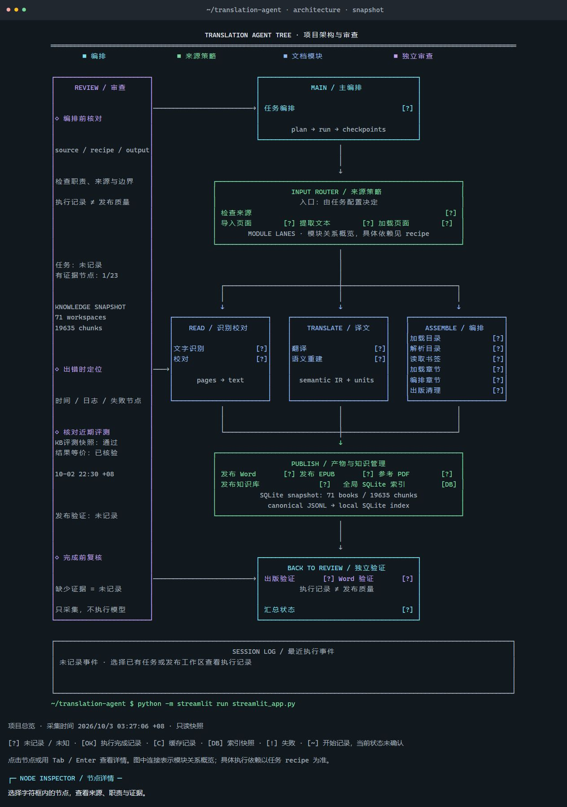
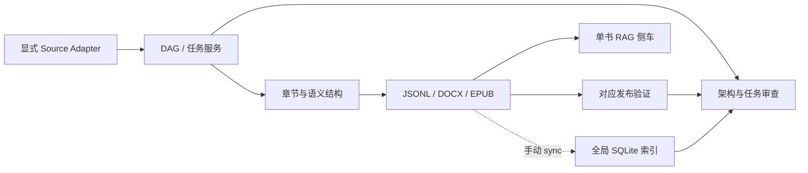

# 影印书编译 Agent

将扫描 PDF、文字层 PDF 与 EPUB 整理为中文章节、知识库和出版物的本地优先工具。
项目通过显式 Source Adapter 接入文档，以 DAG 管理执行依赖、缓存和断点，
以发布验证报告区分草稿与正式交付。

适合需要保留章节结构、来源证据、脚注关系，并反复审校长篇文档的工作流。
OCR 在本地运行；文本翻译和可选向量生成按配置调用模型服务。

## 快速开始

需要 Python 3.11+，推荐 Python 3.12。以下命令在仓库根目录的 Windows
PowerShell 执行；输入书稿和输出目录由用户提供，仓库不附带实际语料。

```powershell
py -3.12 -m venv .venv
.\.venv\Scripts\python.exe -m pip install -e '.[web]'
.\.venv\Scripts\translation-agent-doctor.exe --web
Copy-Item pipeline.example.toml pipeline.toml
```

如已有 `pipeline.toml`，保留现有配置。后续示例使用激活环境后的命令：

```powershell
.\.venv\Scripts\Activate.ps1
translation-agent --help
translation-agent-web
```

工作台默认地址为 [http://127.0.0.1:8501](http://127.0.0.1:8501)。
若执行策略不允许激活，可直接使用 `.venv\Scripts\` 下的同名可执行文件。
WebUI 仅接受 loopback 监听；远程访问应使用带认证的本地隧道。

先预览计划，不调用模型、不生成出版物：

```powershell
translation-agent plan book/input.pdf -o outputs/input --source-mode text-pdf --config pipeline.toml
```

确认输入模式、模型配置与本地依赖后执行：

```powershell
translation-agent run book/input.pdf -o outputs/input --source-mode text-pdf --config pipeline.toml
```

扫描 PDF 使用 `--source-mode scanned-pdf`。该模式需要可用的本地 GPU OCR
环境；Python 包安装本身不提供 GPU 驱动或 OCR 服务。OCR 本地不可用时失败，
不回退到云端 OCR。文字层 PDF 和 EPUB 的导入不需要 OCR。

模型密钥通过设置页面或对应环境变量提供，例如 `DEEPSEEK_API_KEY`、
`ZHIPU_API_KEY`；不要把密钥写入 README、版本库或共享命令记录。
实际模型、端点与 profile 以 `pipeline.example.toml` 和本地配置为准。

## 输入与发布边界

| 输入模式 | 输入要求 | 处理路径 | 交付边界 |
| --- | --- | --- | --- |
| `scanned-pdf` | 扫描 PDF | 本地 OCR → 校勘/翻译 → 章节 → 发布 | 必须通过对应发布门 |
| `text-pdf` | 正文页具有完整可复制文字层 | 文字提取 → 翻译 → 章节 → 发布 | 必须通过对应发布门 |
| `epub` | 可解析的 OPF spine/XHTML | 原生语义导入 → 翻译单元 → 回填 → 草稿 | EPUB-native 发布门尚未接入 |

输入模式由用户显式选择，不根据扩展名或少量文字自动推断扫描/文字层 PDF。
混合型 PDF 应先检查文字层完整性，不能把缺失文字当成空白正文。

EPUB 导入维护章节顺序及脚注引用—定义关系，翻译回填检查源哈希和结构标记。
结构校验通过仍不等于 EPUB-native 正式发布：当前这条路径保留草稿标识，
不能将生成成功解释为 `release_ready`。

正式交付还要满足相应的结构、中文质量和渲染/视觉检查要求。
执行成功、缓存命中、存在 DOCX 文件，都不足以单独证明出版质量通过。

详见 [统一语义 DAG](docs/unified-semantic-dag.md)、
[EPUB 语义输入](docs/epub-semantic-input.md) 和
[产品架构与公共契约](docs/product-architecture.md)。

## 架构与审查工作台

打开工作台导航中的“架构与审查”，或访问
[架构页面](http://127.0.0.1:8501/architecture)。
页面使用等宽字符和 Unicode 框线绘制终端风格树图，提供项目、任务和发布
工作区三个观察入口。



上图为界面快照。下面是布局示意；实际页面中的节点与状态来自项目定义和本地记录：

```text
┌──────────────────┐     ┌──────────────────────────────────────┐
│ 审查与证据       │     │ translation-agent · 项目总览         │
│                  │     └───────────────────┬──────────────────┘
│ 源码位置         │                         │
│ 节点状态         │     ┌───────────────────┴──────────────────┐
│ 发布报告         │     │ 输入适配 / DAG 规划 / 工作区          │
│ 快照时间         │     └───────────────────┬──────────────────┘
│                  │             ┌───────────┼───────────┐
│ 点击节点查看详情 │             ▼           ▼           ▼
│                  │         文档导入     翻译编译     出版与检索
│                  │             └───────────┼───────────┘
│                  │                         ▼
│                  │                 验证报告与产物审查
└──────────────────┘
┌─────────────────────────────────────────────────────────────┐
│ 最近事件 · 开始 / 完成 / 失败 / 缓存复用                      │
└─────────────────────────────────────────────────────────────┘
```

- 点击节点查看职责、节点 ID、源码位置、状态和证据；支持 Tab/Enter 操作。
- “刷新快照”重新读取本地记录；JSON 导出适合审查归档，TXT 导出保留字符树。
- 图中的连接表达模块分组；具体执行依赖由所选 recipe 决定。
- 没有事件的节点显示“未记录”，页面不猜测进度或生成模型调用统计。
- 页面读取任务登记、工作区状态和事件尾部，不启动任务或更改模型配置。
- 历史评测或发布报告是带时间的快照；缺失本机评测材料不影响基本架构查看。

完整操作与数据边界见 [架构与审查面板](docs/architecture-review.md)，
界面设计约定见 [DESIGN.md](DESIGN.md)。

## 命令入口与执行流程

| 命令 | 用途 |
| --- | --- |
| `translation-agent` | 产品 CLI：规划、执行、导入、翻译、回填、发布、审查和状态 |
| `translation-agent-web` | 启动本地任务工作台 |
| `translation-agent-doctor` | 环境预检 |
| `translation-agent-kb` | 单书知识库注册、检索、装置注释与派生产物 |
| `translation-agent-global-kb` | 全局 SQLite 索引同步、检索与验证 |
| `translation-agent-repo-guard` | 检查本地书稿、大文件和密钥的仓库边界 |

产品 CLI 子命令为 `plan`、`run`、`ingest`、`translate`、`apply`、
`publish`、`review`、`status`、`doctor`。使用子命令的 `--help` 查看参数。
`graph_pipeline.py` 提供直接 DAG 入口，`book_pipeline.py` 保留阶段式兼容入口；
旧检查点兼容入口 `pdf_text_agent.py` 不作为新任务的首选。



DAG 根据目标选择依赖闭包，并记录 `.pipeline_graph/state.json` 与事件。
版本、输入和模型配置参与缓存身份判断；缓存复用不能代替最终发布验证。
全局索引通过独立 `sync` 命令更新，目前不自动挂接到每次 pipeline 发布。

内置 recipe：

| Recipe | 使用场景 | 最终验收目标 |
| --- | --- | --- |
| `recipes/full-publication.toml` | 完整多格式出版 | `publication.report` |
| `recipes/chinese-pdf-word.toml` | 中文 PDF 到 Word | `publication.word_report` |
| `recipes/outline-word.toml` | 使用已有 PDF 书签生成 Word | `publication.word_report` |

```powershell
translation-agent plan book/input.pdf -o outputs/input --recipe recipes/full-publication.toml --config pipeline.toml
```

`outline-word` 要求源 PDF 有可用书签。只选择 `publication.docx` 生成的是
未验收中间产物，正式 Word 交付应包含 `publication.word_report`。

## 知识库数据契约

`knowledge_base.jsonl` 是发布与验证层拥有的规范正文，每行严格使用五字段：

| 字段 | 含义 |
| --- | --- |
| `id` | 稳定块 ID |
| `title` | 标题 |
| `chapter_id` | 所属章节 |
| `chapter_order` | 章节顺序 |
| `content` | 块正文 |

RAG 不向这些行追加向量、评分或装置注释。检索清单、向量、可选路由元数据
和装置标注由独立 sidecar 保存，并按各自契约关联正文与校验信息。
正文改变后必须重新验证或重建关联侧车，不能沿用过期向量。

目录、索引、参考材料等可以通过装置注释降权；正文仍保留在规范语料中。
中文语言门默认阻止未经翻译的外文正文注册或进入全局库，参考材料按规则豁免。
`--allow-foreign` 是显式绕过选项，不代表达到中文交付要求。

### 单书检索

以下注册只建立词法路径，不调用 embedding API：

```powershell
translation-agent-kb register outputs/input/knowledge_base.jsonl --lexical-only
translation-agent-kb status outputs/input/knowledge_base.jsonl
translation-agent-kb retrieve outputs/input/knowledge_base.jsonl '社会 个人 文学' --mode hybrid --top-k 5
translation-agent-kb annotate-apparatus outputs/input/knowledge_base.jsonl
```

省略 `--lexical-only` 的注册可以调用配置的 embedding 服务。正式检索统一
`--mode hybrid`，需要有效向量和匹配的 embedding 配置；上面的词法注册只用于
准备正文清单或离线诊断，正式 hybrid 前需完成向量注册。缺资源或服务异常时
明确报告，不以纯 BM25 降级冒充 hybrid。`--mode lexical/semantic` 仅用于诊断。

单书 CLI 的实际子命令包括：`register`、`annotate-apparatus`、`translate-kb`、
`retrieve`、`status`、`evaluate`、`derive-docx`。例如先检查外文翻译范围：

```powershell
translation-agent-kb translate-kb outputs/input/knowledge_base.jsonl --dry-run
translation-agent-kb retrieve --help
translation-agent-kb evaluate --help
```

单书打开时合并正文解析与校验、只加载一次 ready 向量；对象预计算并复用
规范化正文。适用路径用 `heapq` 选择 top-k，保留 BM25、子串加分、装置权重
和并列顺序；跨书限额等需要完整排序的路径保留原语义。
首次打开仍做完整校验和预计算，没有跨 API 请求缓存或懒加载承诺。
Python 高层 API 默认及显式 `mode=None` 均使用真实 hybrid；完整入口与失败
规则见 [知识库正式调用规则](docs/knowledge-base-call-policy.md)。

### 全局 SQLite 索引

SQLite 是可重建的运行索引，规范 JSONL 与发布文件仍是来源。默认数据库
路径由程序管理，也可用顶层 `--db` 指定本地数据库文件。

```powershell
translation-agent-global-kb sync --outputs outputs
translation-agent-global-kb status
translation-agent-global-kb search '自然' --limit 10
translation-agent-global-kb search '资本主义' --per-book-cap 2
translation-agent-global-kb verify
```

全局 CLI 子命令为 `sync`、`status`、`verify`、`evaluate`、`search`。
此处 `search` 是跨书候选发现/诊断接口。正式跨书取证通过模型工具 `kb_ask`
或 `python tools/kb_qa_plugin/kb_qa.py ask "<问题>" --mode hybrid` 完成单书精读，
最终证据不混入只经过 FTS 的发现片段。
`search` 支持 `reader`、`pages`、`archive`、`all` 范围和工作区过滤。
全局 reader 查询默认每书最多一条；`--per-book-cap 0` 关闭限额。

schema 4 使用长词 trigram FTS5，加上一字/二字的 contentless FTS5 倒排索引，
支持中文、假名和韩文短词。短词索引不另存一份编码 token 正文；混合查询
继续遵守既有召回规则。评分和每书限额在 SQL 内完成，Python 只接收最终
结果；SQL 内部仍可能排序，不把这一变化描述为所有排序成本消失。

增量同步对来源执行严格 SHA 清单比较，仅重新导入变化工作区；未变时
复用已有数据。新增、删除、报告依赖、装置标注和资产变化也纳入检测。
变化同步通过 backup 临时快照和原子替换完成；旧 schema 自动重建迁移。

```powershell
# 修复或重新建立全部索引
translation-agent-global-kb sync --outputs outputs --full-rebuild

# 使用自己审定的 JSON 题集评估
translation-agent-global-kb evaluate --cases retrieval-cases.json --report retrieval-report.json
```

`unchanged` 只说明来源清单未变，不表示刚执行完整数据库检查。
用 `verify` 检查当前来源及数据库，用 `--full-rebuild` 恢复或重建。
严格哈希仍随输入字节数增长；变化同步的 backup 与完整性检查仍随数据库
规模增长。精确向量搜索仍为 O(ND)，普通 SQLite 索引不会消除这个成本。

## 2026-10-09 版本说明

本轮把分语种入库流程固化为一组可安装的 DSH/Cordis 插件与配套 skill,
并把知识库正式调用规则、中文质量门、竖排 OCR 与扫描书翻译的修复一并合入。

### 新增入库插件与 skill

| 入口 | 插件 | 配套 skill | 用途 |
| --- | --- | --- | --- |
| `dsh-kb-ingest` | `tools/kb_ingest_plugin/` | `source-to-kb-word-workflow` | Markdown/纯文本/DOCX/EPUB/带文字层 PDF 入库,产出逐字校对通过的中文 Word |
| `dsh-jp-vertical-kb` | `tools/jp_vertical_kb_plugin/` | `japanese-vertical-kb` | 竖排日语扫描书分阶段入库:OCR → 逐页翻译 → 出版验收 → 单书注册 |
| `dsh-chinese-pdf-kb` | `tools/chinese_pdf_kb_plugin/` | `chinese-pdf-body-kb` | 中文横排扫描 PDF 正文重建与入库,分离页下注、编者材料与版面噪声 |
| `dsh-english-pdf-kb` | `tools/english_pdf_kb_plugin/` | `english-pdf-kb` | 英文原文 PDF 译为中文选文知识库,区分编者导言与选文 |
| `kb-reader` | `tools/kb_qa_plugin/` | — | 会话问答工具:检索取证 → 引文核验 → 再作答,书内论断须标《书名》·章节出处 |

插件只做入口与参数校验,各阶段质量仍由本仓库的发布门与检索验收决定;
工具注册成功不代表某本实书已通过质量门。书籍修复脚本继续收拢在
`tools/books/`(本轮新增施米特两册正文重建/读者版与《私小説論》验证目录)。

### 检索调用规则

- Python 高层 API 与 `kb_ask` 默认真实 hybrid;向量缺失、embedding 身份
  不一致或 provider 失败时显式报错,不以纯 BM25 降级冒充 hybrid。
  `--mode lexical/semantic` 仅用于诊断。
- 正式入口与失败规则见[知识库正式调用规则](docs/knowledge-base-call-policy.md);
  分书语料/全局索引两条链路与存储设计见
  [全局知识库数据流](docs/global-knowledge-base-dataflow.md)。

### 质量门与修复

- 发布校验器新增 `knowledge_base.chinese` 与 `docx.chinese` 检查,复用
  kb_translation/docx_translation 的离线中文判定;对照表、书目、索引等
  双语装置豁免。管线图与门说明更新于 `docs/product-architecture.md`。
- `kb_translation` 新增汉字主导判据:假名占比低于 20% 且汉字足够时按
  "中文带引注残留"豁免,修复日文引注残留把中文块判为外文、语言门永久
  卡住的假阴性;阈值来自 202 页竖排日文样本的实测分布。
- 竖排 OCR 按页检测方向(`--reading-direction auto`),日文纵排按右起
  列序、上起行序输出并保留原始行框;OCR 检查点记住方向参数。
- 扫描书逐页翻译默认请求可见译文,拒绝空译文、残留外文段落与原文没有
  的省略号,复杂页仅对失败段落定点补译;`translate-kb` 新增 `--concurrency`
  应对 provider 限速。
- 新增 10 个测试模块,覆盖四个入库入口、hybrid 调用策略(离线,不调
  embedding 服务)、竖排阅读顺序与 OCR 提示保真。

## 2026-10-03 版本说明

本轮增加终端字符风格架构与审查面板，并优化知识库重复加载、规范化、
候选选择、短词检索和增量同步。原始语料未因这些索引优化而改写。

以下为开发机已有语料的本地样本验证，不是首次 clone 自动复现的基准，
也不代表所有查询或生产延迟分布：

| 样本 | 优化前 | 优化后 |
| --- | ---: | ---: |
| 鲁迅全集，已打开对象查询“社会 个人 文学” | 517 ms | 31 ms |
| 全局查询“自然” | 164 ms | 48 ms |

46 条本机评测查询的 ID、分数及顺序与基线一致，301 个正文和侧车文件
哈希不变。鲁迅全集首次打开仍约 2.5 秒；短词索引让样本数据库额外增加
约 37 MiB。这是以磁盘换检索成本的明确取舍。

完整数据、适用条件与实现边界见
[知识库运行内核与性能验证](docs/knowledge-base-performance.md)。

## 开发与验证

```powershell
python -m pip install -e '.[dev]'
python -m unittest tests.test_rag_performance tests.test_global_kb_search_performance tests.test_global_kb_incremental
python -m unittest tests.test_architecture_ascii tests.test_architecture_dashboard tests.test_architecture_page
python -m unittest discover -s tests -q
git diff --check
```

功能验证采用本地 fixture 与可注入 provider；实际 GPU OCR、模型调用和
Word 渲染属于各自环境验收，不应由单元测试通过推断其可用。
修改发布规则时还应检查正文、脚注、中文质量及报告 freshness。

| 目录 / 模块 | 职责 |
| --- | --- |
| `document_pipeline.py` / `product_contracts.py` | 产品命令与版本化运行契约 |
| `pipeline_graph/` / `recipes/` | DAG 节点、执行器、缓存与目标组合 |
| `book_pipeline.py` / `publication_verifier.py` | 编译发布与质量门 |
| `semantic_ir.py` / `semantic_apply.py` | 语义结构与翻译回填 |
| `rag_knowledge_base.py` / `rag_apparatus.py` | 单书检索、向量与装置标注 |
| `global_knowledge_base.py` | 全局 SQLite 索引 |
| `frontend_runtime.py` / `application_service.py` | 任务登记与应用服务 |
| `architecture_dashboard.py` / `architecture_ascii.py` | 架构快照与字符树 |
| `skills/` / `tools/*_plugin/` | 分语种入库 skill 与 DSH/Cordis 插件 bundle |
| `app_pages/` / `streamlit_app.py` | 工作台页面 |
| `tests/` / `docs/` | 回归测试与专题文档 |

更多说明：[产品架构](docs/product-architecture.md) ·
[语义 DAG](docs/unified-semantic-dag.md) ·
[EPUB 输入](docs/epub-semantic-input.md) ·
[架构审查](docs/architecture-review.md) ·
[性能验证](docs/knowledge-base-performance.md) ·
[调用规则](docs/knowledge-base-call-policy.md) ·
[全局数据流](docs/global-knowledge-base-dataflow.md)。
