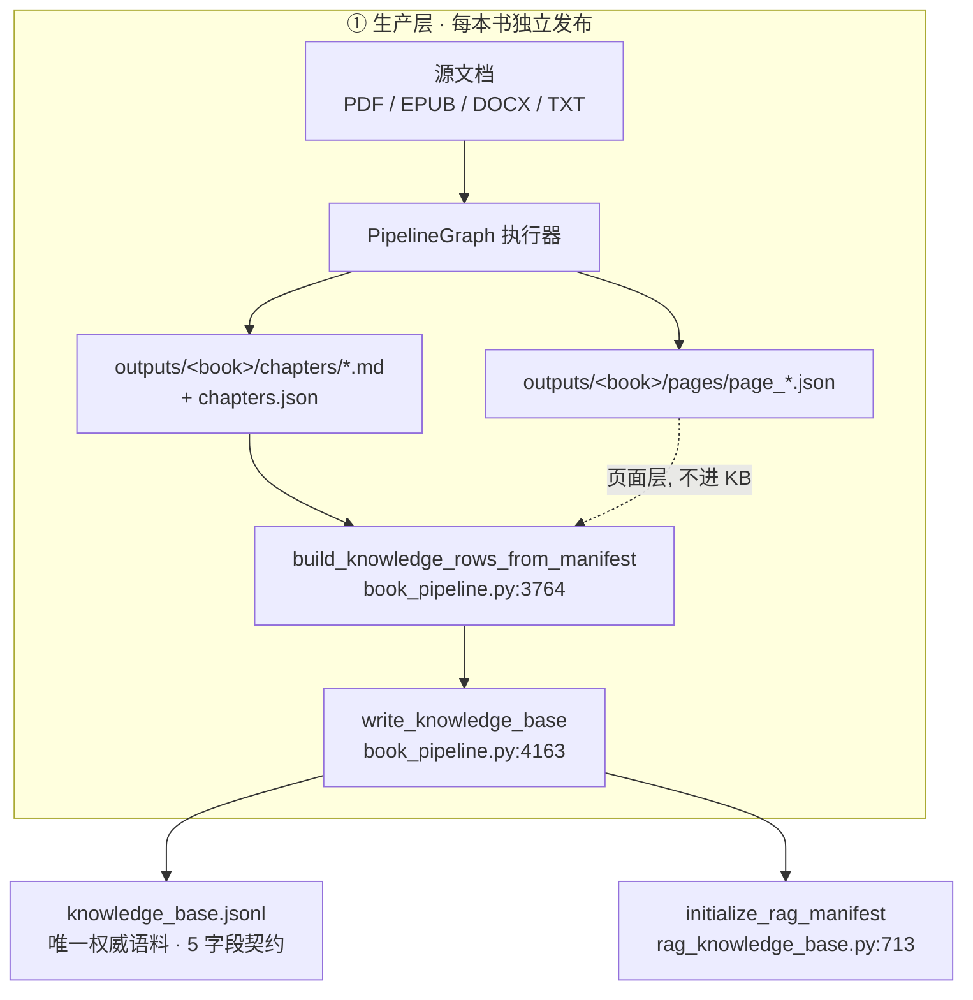
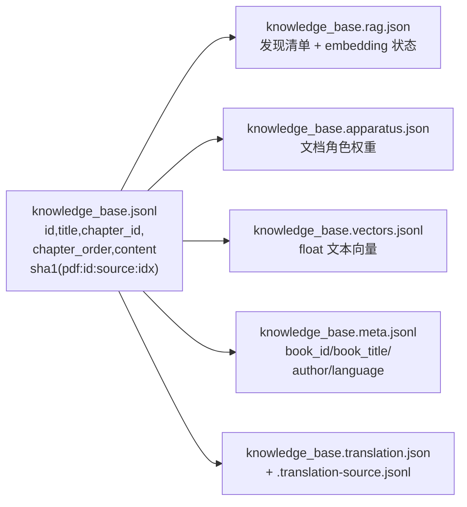
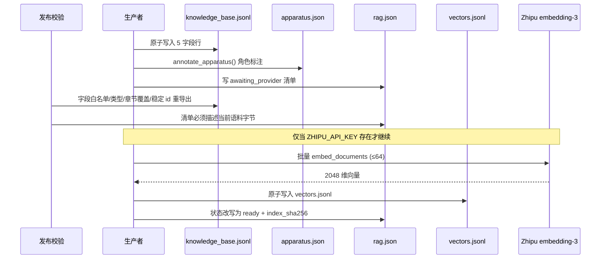
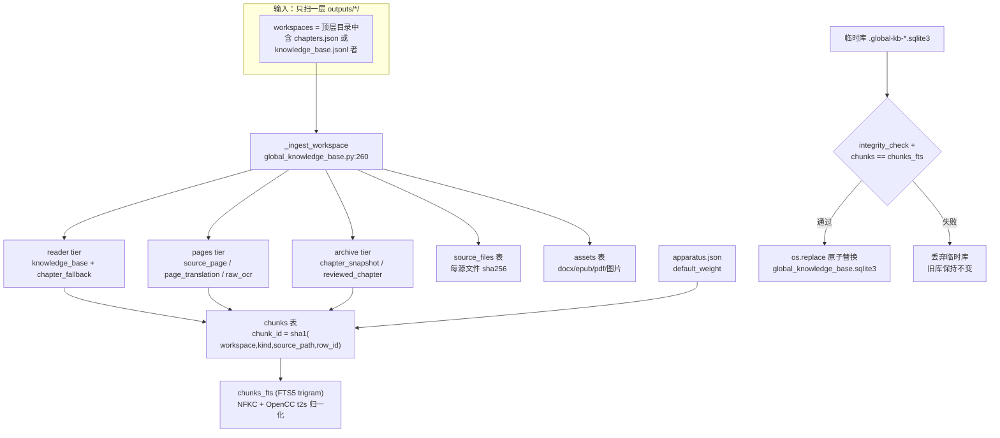
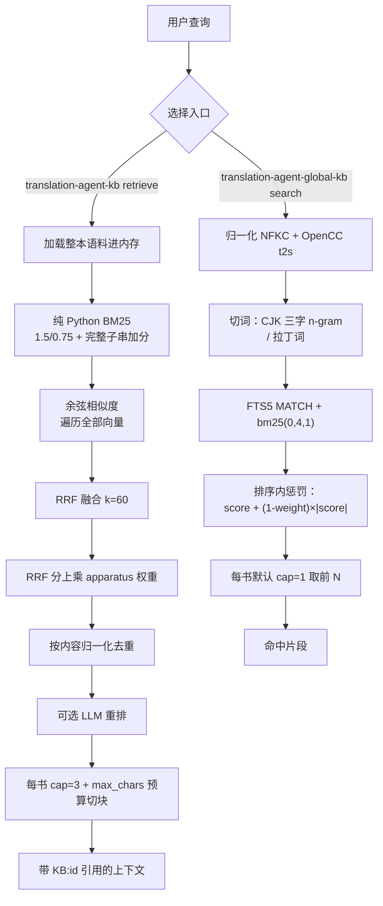
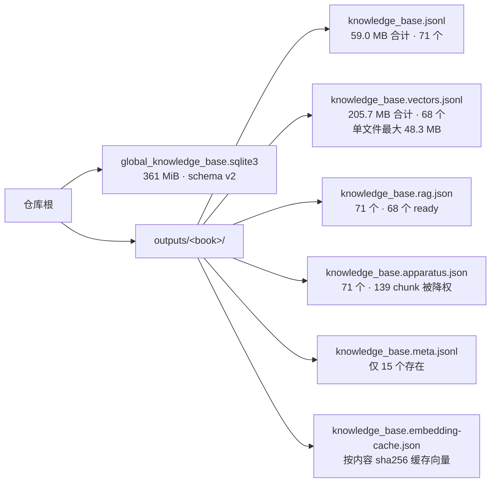

# 全局知识库：数据流、存储方式与设计评估

本页描述 `global_knowledge_base.py`（全局索引）与 `rag_knowledge_base.py`（分书 RAG 运行时）
之间的真实关系，以及它们各自的存储布局。所有结论均来自代码与磁盘实测。

实测环境：`outputs/` 下 71 个 `knowledge_base.jsonl`、66 个已入全局索引的 workspace、
`global_knowledge_base.sqlite3` = 378,494,976 字节（361 MiB）、
向量 sidecar 合计 205.7 MB。

> 测量说明：延迟为单次运行的观测值，未取多次平均；向量体积在核对过程中
> 因重建索引而变化过一次（196.2 MB → 205.7 MB），下文数字以最终测量为准。

## 1. 总览：两条互不相连的链路



*图 1 说明生产入口只有一处*：`write_knowledge_base` 是所有 KB 写入的收敛点
（另有 `derive-docx`、`translate-kb`、EPUB adapter 与 `tools/books/*` 直接调用）。

## 2. 分书语料与四个 sidecar





三重一致性绑定，任一环节失配都会 fail-closed：

| 绑定 | 位置 | 校验内容 |
| --- | --- | --- |
| `documents_sha256` | `rag_knowledge_base.py:648-657` | 清单 ↔ KB 字节 + 行数 |
| `index_sha256` | `rag_knowledge_base.py:681-686` | 清单 ↔ 向量文件字节 |
| `documents_sha256`（索引头） | `rag_knowledge_base.py:571-575` | 向量文件 ↔ KB 字节 |
| 向量 id 顺序 | `rag_knowledge_base.py:614-617` | 向量 ↔ KB 行顺序 |
| 标注 id 集合 | `rag_apparatus.py:78-84` | 标注 ↔ KB 行 id 集合 |

## 3. 全局索引链路（单向聚合，无回写）



全局库共 11,922 chunk：`knowledge_base` 7,242、`source_page` 2,997、
`chapter_snapshot` 1,501、`page_translation` 157、`reviewed_chapter` 25；
其中 9,821 属于 reader tier（`knowledge_base` + `chapter_fallback`），
3,154 是 pages tier，其余 1,526 是 archive tier。`scope` 默认 `reader`，
所以默认检索面只覆盖前 9,821 条。

## 4. 查询路径：两个并存的运行时



实测延迟（同一台机器，本仓库数据）：

| 路径 | 语料规模 | open/首次 | 单次查询 |
| --- | --- | --- | --- |
| 全局 FTS5 | 11,922 chunk（361 MiB 库） | 无（连接即用） | **12–103 ms** |
| 分书 RAG（词法） | 1,730 chunk（13.8 MB） | 2.74 s | **0.48–1.10 s** |

## 5. 存储布局



`chunks` 表：`id, workspace, kind, chapter_id, chapter_order, title, content,
content_sha256, source_path, source_row_id, source_metadata, apparatus_weight`。
`workspace` 主键直接使用目录名，因此引用一个结果需要回显书名全称。

## 6. 设计评估

### 6.1 合理之处

1. **契约层与派生层分离干净。**`knowledge_base.jsonl` 严格 5 字段
   （`rag_knowledge_base.py:424-429` 用集合相等校验，多一个字段就报错），
   所有增强信息走 sidecar。这是本设计最有价值的一点：语料契约稳定，RAG 能力可替换。
2. **发布与校验是双向绑定的。**生产者写 5 字段，校验器反向重导出稳定 id 并核对
   无损分块覆盖（`publication_verifier.py:3812-3874`），生产者与校验器不能各自漂移。
3. **全链路原子发布。**KB 写入、sidecar、向量、全局库替换都走
   `_atomic_write_text` / `os.replace`；全局库先建临时库、`integrity_check`
   通过且 `chunks == chunks_fts` 才替换（`global_knowledge_base.py:451-457`）。
4. **陈旧检测是哈希驱动而非时间戳。**三处 `sha256` 绑定 + 标注 id 集合校验，
   使"改了语料但忘了重建索引"变成显式错误而不是静默错配。
5. **向量重建是内容寻址增量的。**`build_embedding_index` 按
   `sha256(title + content)` 命中 `.embedding-cache.json`（`rag_knowledge_base.py:795-811`），
   只对缺失批次调 API；`rag_indexing` 的相同重建会保留向量文件。
6. **检索分层与角色降权是有依据的。**reader/pages/archive 三档、apparatus 权重
   在排序**内部**生效（`global_knowledge_base.py:612-617`、`rag_knowledge_base.py:1483-1486`），
   避免了"先截断后降权"的经典错误；测试同时锁定了有/无 sidecar 两种结果。

### 6.2 主要问题

#### P1 · 两条链路没有任何连接（最严重）

`global_knowledge_base.py` 在运行时代码中**零引用**：全仓库只有
`pyproject.toml:34` 的 console script、`tests/test_global_knowledge_base.py:10`
和 README。而 `translation_agent_api.py:367 retrieve_knowledge_base_context`
也没有生产调用方，`app_pages/` 四个页面与 `frontend_app.py` 均不涉及检索。

后果：项目实际拥有**两个独立实现的 BM25**——SQLite FTS5 trigram（全局）与
手写纯 Python BM25（分书）。两者分词、IDF 公式、分数尺度都不同
（全局是三字 n-gram，分书是单字 + 双字 + 完整子串加分），跨库分数不可比，
任何评测结论都不能互相迁移。

#### P2 · 已具备跨书语义检索条件，但没有做

68 个向量索引**全部**是同一身份：`zhipu / embedding-3 / 2048 维`，
合计 7,369 个向量。也就是说，分片向量空间天然同构，
合并成一个跨书语义索引在数学上不需要重新编码。但现实是：

- 全局库里**没有任何向量列**，只有 FTS5；`sync_outputs` 不读 `.vectors.jsonl`。
- 分书 `retrieve` 一次只能打开**一本** `knowledge_base.jsonl`。

所以"跨 66 本书的语义检索"这个能力目前不存在，只能靠关键词。这是投入产出比最高的改进点。

#### P3 · 向量存储形式造成 3.3 倍空间浪费

`build_embedding_index` 把向量写成 JSON 文本（`rag_knowledge_base.py:828-837`），
每个 float 以完整十进制精度输出，实测每个数约 13.3 字节：

- 实测：最大单文件 48.3 MB / 1,730 chunk / 2048 维 → 每个向量约 27,900 字符。
- 全部向量 205.7 MB，而 `float32` 只需约 60 MB，`int8` 量化约 15 MB。
- 按 chunk 数是 7,369，而全局 reader 层是 9,821 —— 两者规模相当。

同时 `RagKnowledgeBase.open()` 会 `json.loads` 全部向量行并建 `tuple`
（`rag_knowledge_base.py:1084-1088`），单次查询前就把整份向量读进内存。

#### P4 · 全局索引扫描深度与工作区判定不一致

`sync_outputs` 只用 `root.iterdir()` 扫一层（`global_knowledge_base.py:422-428`），
且要求目录直接含 `chapters.json` 或 `knowledge_base.jsonl`。实测漏掉了 5 个语料：

```
outputs/知识库_日本思想政治/sources/01_翻译与近代日本/knowledge_base.jsonl   (深度 4，有 vectors)
outputs/知识库_日本思想政治/sources/02_共同幻想論/knowledge_base.jsonl      (深度 4)
outputs/知识库_日本思想政治/sources/03_日本的思想/knowledge_base.jsonl      (深度 4，有 vectors)
outputs/知识库_日本思想政治/sources/04_終わりなき日常を生きろ/knowledge_base.jsonl
outputs/知识库_日本思想政治/sources/05_去政治化的政治/knowledge_base.jsonl
```

其中 3 个已经花过 embedding API 调用建好了向量，却不在任何跨书检索里。
更值得警惕的是 `verify_sources` 用了同样的扫描方式（`global_knowledge_base.py:509-522`），
所以它报 `current=True`——**陈旧检测本身看不见这些语料**。

#### P5 · 质量门当前是失败的，且失败原因是元数据

实时复跑（不是读旧报告）：

```
passed: false        workspace_count: 66   （fixture 期望 61）
cross_book hit@1 0.867 / hit@5 1.000   （阈值 0.80 / 0.95）→ 通过
chapter    hit@1 0.875 / hit@5 1.000   （阈值 0.85 / 0.90）→ 通过
```

指标全部达标，唯一失败项是 `tests/fixtures/global_kb_retrieval_cases.local.json`
里写死的 `expected_workspaces: 61`，而 `work/global_kb_evaluation.json` 里
保存的是一份 `workspace_count: 61` 的旧记录。把一个随语料增长的计数写成硬门，
会让门在语料正常增长时永久红灯，从而失去信号价值。

#### P6 · 路由元数据只有 21% 覆盖率

71 个语料中只有 15 个有 `knowledge_base.meta.jsonl`。`_book_key` 在缺失时
回退到 `[书名]` 标题前缀或 `chapter_id` 前缀（`rag_knowledge_base.py:1163-1186`），
`infer_query_routes` 的按书/按作者路由因此对多数语料失效。
全局库把 `meta` 的 `book_title/author/language` 塞进 `source_metadata` JSON 文本，
但 `search()` 的过滤条件只有 `workspace` 和 `report_status`——没有按书/作者/语言的过滤。

#### P7 · 默认检索面混入未验证与易污染内容

- 66 个 workspace 中 `report_status` 为 `passed` 的只有 **5** 个，
  `missing` 58 个、`failed` 3 个。默认 `verified_only=False`，
  因此草稿与校验失败的书默认参与检索。
- 全局库 11,922 chunk 里有 3,154 是 pages 层（含 `raw_ocr`），
  1,526 是章节快照与 reviewed 归档。`scope` 默认 `reader` 能挡住大部分，
  但 `all` 会把原始 OCR 错误文本一并召回。
- 目录名作为主键，实测存在 `_extract_full`、`_ch4_section`、`知识库_鲁迅全集`
  这类"聚合/中间产物"目录与正常书目录并存，靠命名约定而非显式标记区分。

#### P8 · 一致性与小缺陷

- `_report_status` 只看 `mtime`（`global_knowledge_base.py:155-157`），
  而索引侧全部用 `sha256`；两套陈旧判定语义不统一。
- `initialize_rag_manifest` 只要清单能被解析就原样返回
  （`rag_knowledge_base.py:726-731`），不校验 `documents_sha256`；
  真正的校验推迟到 `read_rag_manifest`。
- `search()` 把 11 KiB 的 `content` 整行取出后再在 Python 里切 90/230 字符的
  `excerpt`（`global_knowledge_base.py:634-645`），没有用 SQL `substr`。
- 全局库 `kind='knowledge_base'` 有 4 个 chunk 超过 4,000 字符（最大 11,150），
  说明"分书 4,000 字符上限"这一不变量在全局库里并不成立。
- `kb_translation` 的就地改写会同时使 `documents_sha256` 与 `index_sha256` 失效，
  即 205.7 MB 向量需要重新调用 API；流程正确，但代价与副作用应写进文档。

### 6.3 改进建议（按性价比排序）

| 优先级 | 改进 | 落点 | 预期收益 |
| --- | --- | --- | --- |
| 高 | 向量改二进制存储（`float32`/`int8`），加载时按需归一化 | `rag_knowledge_base.py:818-837` | 205.7 MB → 约 60 MB / 15 MB |
| 高 | 合并单一跨书语义索引：同构向量直接并入全局库 | 新增 `sync` 后处理 + `search` 增加向量通道 | 打通跨 66 本书的语义检索 |
| 高 | 全局扫描改 `rglob` 并用"含 KB 文件"判定工作区，`verify_sources` 同步 | `global_knowledge_base.py:422-428, 509-522` | 找回 5 个语料，且陈旧检测不再有盲区 |
| 高 | 质量门的 `expected_workspaces` 改为下限或去掉硬等值 | `tests/fixtures/global_kb_retrieval_cases.local.json` | 门恢复有效 |
| 中 | `search()` 增加 `book_id/author/language` 过滤，把 meta 提升为一等列 | `global_knowledge_base.py:178-186, 584-596` | 路由能力对齐分书链路 |
| 中 | 统一 `_report_status` 为哈希判定；`search` 用 SQL `substr` 出摘要 | `global_knowledge_base.py:137-160, 612-617` | 语义统一 + 降低取数开销 |
| 中 | 把分书 BM25 换成与全局一致的 FTS5（或反之），只保留一套评分实现 | `rag_knowledge_base.py:942-1023` | 消除两套 BM25 的漂移 |
| 低 | 给 corpus 加显式 `role`（book / aggregate / intermediate）字段，不再靠目录名 | 生产者 + `workspaces` 表 | 引用与过滤可靠 |
| 低 | 为嵌套与聚合语料补写 `meta.jsonl`，覆盖率从 21% 提升 | `tools/books/*` | 按书/作者路由在全部语料生效 |

## 7. 修复记录（对照外部评审的六项问题）

> 2026-09 追加：在 §3 的全局同步入口与发布校验器上新增了中文语言质量门
> （外文 reader 块 / Word 外文段落必须先译为中文，`--allow-foreign` 可临时
> 绕过）。完整管线图与门的判定规则见
> [product-architecture.md](product-architecture.md)。

针对一份外部评审提出的问题清单，以下修复已实施并验证（schema v2 → v3，
需重新 `sync`）：

| 评审问题 | 修复 | 验证 |
| --- | --- | --- |
| High-1 apparatus 旁车损坏时静默恢复权重 1 | 旁车存在且不可解析 / `documents_sha256` 过期 / 标注未覆盖全部行时，`sync` 中止并保留旧库（`_apparatus_weights` 严格校验，镜像 `rag_apparatus.load_apparatus`） | `ApparatusSidecarValidationTests`（3 例） |
| High-2 `verify` 不跟踪旁车、报告与审核依赖 | `source_files` 新增 `apparatus` / `release_report` / `report_dependency` 三类登记（+83 个文件），`verify` 扫描同步扩展；`report_status` 明确为同步快照 | `SourceFreshnessTests`（3 例） |
| 中-3 两字词被丢弃、多短词退化为整串匹配 | `_query_terms` 拆分长/短词：纯短词查询按"全部出现"AND 组合；混合查询中短词只用于摘要高亮（实测硬 AND 会把跨块章节的最佳块挤出，chapter-01/16 因此回归后回退）；子串回退分支同样应用装置降权 | `ShortQueryTests`（3 例）+ 46 题评测 |
| 中-4 每书限额在候选截断之后执行 | 限额改在不含正文的轻量候选行上计算（两段式取数；SQLite 窗口函数无法求值 `bm25()`，故在 Python 侧排序限额） | `PerBookCapTests`（2 例，含 250 行单书挤占场景） |
| 中-5 逐文件读取无同一时间点保证 | `chapters.json` 单次读取同时供解析与哈希；全部已解析/哈希源记录 mtime+size，替换前 `_assert_sources_stable` 复核，改动即中止 | `SyncStabilityTests` |
| 中-6 评测把工作区数固定为 61 | `expected_workspaces` 从等值改为下限：新增书籍不失败，语料缩水仍失败 | `EvaluationGateTests`（2 例） |

修复后实测（66 工作区，source_files 3,548）：21 项单测全过；46 题评测
`passed=true`，跨书 Hit@1 0.867 / Hit@5 1.000，章节 0.875 / 1.000，
与修复前基线一致；`自然 正式`（原 0 命中）现可跨词隙命中，
`康德 鉴赏判断` 首命中《判断力批判（上）》。

## 8. 结论

数据流的骨架是健康的：单一权威语料 + sidecar 增强 + 哈希绑定的三层陈旧检测 +
全链路原子发布，这些是本项目做得最扎实的部分，`knowledge_base.jsonl` 的 5 字段
契约值得保持。核心问题不在"存得对不对"，而在**"建好了但没接起来"**：
向量索引已经为 68 本书建好且身份完全同构，却没有跨书语义检索；
全局 SQLite 索引把单次查询从秒级降到毫秒级（1–2 个数量级），却在生产代码里零调用方；
一个已建好向量的语料子目录因为扫描深度而被静默留在索引之外，
连陈旧检测也看不到它。因此下一步的收益主要来自**接线与收敛**，
而不是再造一层索引。
