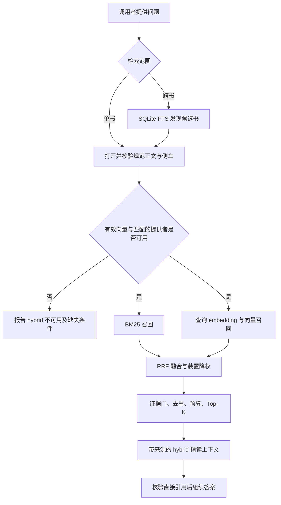

# 知识库正式调用规则

正式知识库检索统一请求并执行 `hybrid`：BM25 与向量召回通过 RRF 融合。
这项规则适用于问答、细读与引用取证；状态、书目、索引管理和逐字引文核验
仍使用它们各自的精确操作。低层 lexical/semantic 只用于明确的诊断和基线。



## 入口

```powershell
# 正式单书检索
translation-agent-kb retrieve "<工作区>" "<问题>" --mode hybrid

# 模型工具或 CLI 的正式跨书取证
python tools/kb_qa_plugin/kb_qa.py ask "<问题>" --mode hybrid
```

有 `kb_ask` 工具时使用 `mode="hybrid"`。正式工具保持 `reader` 范围、向量
与精读开启；不允许通过 `semantic=false` 或仅做发现来绕过。

Python 高层 API `retrieve_knowledge_base_context` 默认模式及显式 `None`
都解析为 hybrid；它与 CLI、插件共用 `retrieve_hybrid_context`。未显式
注入提供者时，只按有效的 `zhipu/embedding-3` 清单自动解析；其他提供者
须明确注入。模型身份和维度继续按向量清单校验。

## 失败和部分覆盖

- 缺向量、索引陈旧、提供者不匹配、密钥缺失或 embedding 服务错误均明确报告，
  不静默回退 BM25 再标记为 hybrid。查询不自动批量重建向量。
- SQLite FTS 的结果只用于候选发现，不能补回正式 `hits/context` 冒充精读。
- 部分候选书不可用时可以返回其余成功的 hybrid 证据，必须保留被跳过工作区
  及部分覆盖诊断。所有候选都不可用与成功执行但无证据，是不同状态。
- 一条命中可仅由其中一个通道召回；这是正常融合结果。判定整次执行使用
  实际模式及诊断，不要求每一条命中都同时包含两个通道。
- 页面/存档没有等同 reader 的现成向量契约，不把 reader 精读伪标为 pages
  或 archive hybrid。需要原页时走明确的查看/逐字核验操作。

## 诊断例外

显式 `--mode lexical`、`--mode semantic`、`--lexical`、`--no-deep` 和全局
`search` 保留为离线基线、候选发现或诊断用途；其输出不作为正常 hybrid
问答的替代品。`tools/benchmark_kb_core.py` 的词法性能基准保持离线。

所有资料出处、装置角色和引用核验规则继续生效。模型分数并不自动构成
答案证据，历史发布/评测状态也不是本次来源重新验收。
