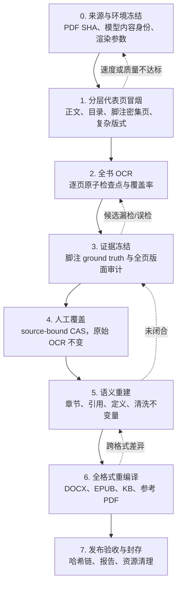

# 本地 OCR 书籍发布复盘与改进准则

本文复盘一次双 A100、PaddleOCR、本地影印 PDF 到 DOCX/EPUB/知识库/参考 PDF
的完整交付。重点不是复述某一本书的人工修订，而是把暴露出来的问题转成以后
每本书都能执行的工程门禁。

案例最终处理 205 个 PDF 页面，OCR 阶段约 37.7 秒（约 5.44 页/秒），并在
发布层闭合 365 个脚注引用与定义。上述数字只用于说明问题规模，不是其他书籍
应当硬编码的验收阈值。

## 核心结论：速度和正确性必须分账

“OCR 跑完”只说明页面任务完成，不能说明书已经可以发布。这个任务中，GPU
推理很早就达到可用吞吐，但此后仍发现脚注跨页/跨章归属、少量专名误识别、
印刷页码进入 DOCX、证据报告绑定旧哈希等问题。它们都不会反映在 pages/s 上。

| 账本 | 回答的问题 | 主要指标 | 成功条件 |
| --- | --- | --- | --- |
| 速度账本 | 机器多快、多稳地生成逐页检查点？ | 渲染/推理 pages/s、p50/p95、GPU 显存与利用率、队列等待、失败重试、预热时间 | 代表页和全书运行均无超时、漏页或异常尾延迟 |
| 质量账本 | 页面文字和出版结构是否忠于原书？ | 页覆盖、字符抽检、脚注召回/精确率、引用—定义闭环、章节边界、跨格式可见全文一致性 | ground truth、语义门、容器门和渲染门全部通过 |

因此，调大实例数、batch 或渲染并发时，必须同时运行固定质量样本；没有字符
错误率或结构召回基线时，不能仅凭吞吐提升切换精度、TensorRT 或图像缩放策略。

## 本次问题：症状、根因、修复与长期门禁

| 症状 | 根因 | 本次如何修复 | 应固化的长期门禁 |
| --- | --- | --- | --- |
| OCR 已完成且很快，但出版物仍不正确 | 把页任务成功误当成内容正确和发布成功 | OCR、语义重建、容器发布、最终验收分别报告 | OCR 命令成功只能登记 `pages.raw`；只有完整 release report 通过才能标记 `release_ready` |
| 脚注总数在不同重建方式间变化，旧式数字注与圈码注不能一次闭合 | 标记体系不止一种，定义还可能出现在相邻页或章节物理边界外；逐页正则没有章节语义 | 建立人工脚注 ground truth；显式解析多种标记；允许有证据的相邻页归属；定义在章级收集并检查唯一性 | ground truth 总数与分章计数精确匹配；引用、定义、ID 一一对应；重复、孤儿、未解析标记一律阻断 |
| 章节开头/结尾出现错位注释，正文换行未正确回流 | 脚注定义所在物理页与正文所属逻辑章并不总相同，且结构块曾被当作普通正文 | 用来源页证据修正归属；把现有 Markdown 定义从正文中提取，章末统一发射 | 每条定义保存来源页和逻辑章；跨章迁移必须来自审定覆盖层，不能靠“最近标题”猜测 |
| 引用—定义闭环已通过，脚注中仍有少量人名、书名误识别 | 结构闭环只能证明“有注”，不能证明注释逐字准确；低频专名对 OCR 更难 | 对脚注区域逐页看图，修正项以来源绑定的人工覆盖层提交，原始 OCR 不变 | 对高风险区域建立图片 ground truth；自动布局审计负责找全候选，逐字正确性由抽检或人工审定保证 |
| 清洗后独立印刷页码仍出现在 DOCX，Markdown 粗看不明显 | 先附加章末脚注定义、后清理正文，使原本位于章尾的页码不再是“尾行”，逃过清洗 | 先对纯正文执行出版清洗，再附加结构化定义；发布器与验证器使用同一可见文本契约 | DOCX/EPUB/知识库逐章与 reader Markdown 做可见全文精确比对；增加“章尾页码 + 脚注定义”回归用例 |
| 更新 ground truth 后，旧审计报告仍指向同一路径，看似是当前证据 | 可变文件路径被误当成不可变证据身份；报告没有强制绑定内容摘要 | ground truth、锚点和最终报告使用 SHA-256 绑定；历史报告明确标为 superseded | 任一证据字节变化都使消费报告失效；报告必须记录源 PDF、页检查点、ground truth、覆盖层和代码/配置身份 |
| 临时人工修改能解决当前输出，却难以复现或可能被下一次编译覆盖 | 直接编辑派生 Markdown/JSON，没有记录前置版本和修改意图 | 每组人工修订写成幂等脚本，并生成页列表、前后 SHA 和复核报告 | 所有人工覆盖必须通过 CAS：输入 SHA 不符就拒绝；禁止把直接改最终 DOCX/章节文件当成正式修复 |
| 全书重建后出现只在某一容器中的回归 | 只复跑了局部阶段，或修改语义规则后沿用了旧派生产物 | 从当前 `effective_text` 重建章节、语义、所有容器和最终报告 | 上游内容/规则身份变化必须使下游缓存失效；最终验收必须在同一轮构建产物上完成 |
| 任务结束后 GPU 仍被常驻 OCR 服务占用 | 为摊薄模型预热成本启用了 persistent service，但交付流程没有终态清理 | 使用服务协议正常停服，再核对 socket、进程和 `nvidia-smi` | CI/批处理增加 finally 清理；只终止本任务记录的 UID/socket/PID，不得用模糊进程匹配误杀其他作业 |

## 推荐的分阶段验收

下面的顺序把昂贵的全书重编译放在证据已经稳定之后。前一阶段未通过时，不应
用后一阶段生成的“看起来正常”的文件掩盖问题。



### 0. 冻结来源与运行身份

- 记录源 PDF SHA-256、页数、source mode、OCR 模型/引擎/精度、阅读顺序版本；
- 把模型和算法放在 `content identity`，把 GPU 编号、实例数、batch、队列放在
  `runtime identity`；吞吐调参不应无故污染内容缓存；
- DPI、最大边长、压缩质量属于逐页内容输入，改变后必须刷新相应检查点；
- 输出目录必须绑定来源，禁止不同 PDF 或 adapter 静默共用。

### 1. 用分层样本同时确定速度与质量

20 页连续冒烟只能发现部署错误，不能代表整本版式。代表集至少应包含：

- 普通正文页、浅色/歪斜/低对比页；
- 目录、章首页、末页与跨章边界；
- 脚注密集页、脚注从上一页延续的页面；
- 表格、引文、特殊符号、双栏或边栏页面。

每种配置记录端到端与纯推理的 pages/s、p50/p95、显存、失败率，同时比较固定
文字与结构样本。先选择满足质量底线的配置，再在其中选择吞吐最高者。对于小型
OCR 模型，两张 GPU 通常按页面做数据并行比 tensor parallel 更合适；实例数应
通过实测决定，不能把“显存还能放下”当作有效扩容依据。

### 2. 全书 OCR 只生成不可变原始层

- `text` 与逐页 Markdown 是原始 OCR 证据，写入后不被人工脚本覆写；
- 每页原子落盘，并记录源、模型、渲染和文字 SHA；
- 完成条件是预期页集合精确相等，而不是日志出现“100%”；
- 重试只重算缺失或身份陈旧页，不能为修四个字重跑整本 OCR。

### 3. 冻结脚注 ground truth 与全页版面证据

脚注是影印书最容易“数量看似合理、位置实际错误”的结构。ground truth 应至少
记录以下字段：

| 字段 | 用途 |
| --- | --- |
| `source_pdf_sha256`、`physical_page` | 把判断绑定到源书具体页面 |
| `anchor_id`、`marker_form`、`logical_chapter` | 区分不同编号体系及逻辑归属 |
| 定义区坐标/分隔线坐标、证据图 SHA | 支持后续复核而不是只信 OCR 文字 |
| 定义文字或规范化摘要、连续/跨页关系 | 验证识别与拼接 |
| reviewer、review status、生成工具版本 | 说明证据强度和来源 |

自动版面审计应覆盖全部物理页，分别报告：预期定义页召回、额外候选页、坐标
异常和未判定页。自动检测适合证明“候选没有漏扫”，不能独自证明每个专名逐字
正确；后者仍需要原图抽检或人工审定。

ground truth 一旦封存，内容 SHA 就是它的身份。若审定结论变化，应生成新版本
并使旧报告失效；旧报告保留原始 SHA 和 `historical/superseded` 状态，不能改写
成好像曾经验证过新证据。

### 4. 人工覆盖必须 source-bound 且 CAS

推荐保留三层：

1. `raw OCR`：不可变机器输出；
2. `proofread/overlay`：人工或模型修订，绑定 raw/effective source SHA；
3. `semantic/reader`：由当前有效页文本确定性生成的派生层。

覆盖脚本在提交前比较预期 SHA 与当前 SHA。若不一致，说明页面已被其他修订
改变，应重新看图，而不是把旧补丁强行套上。每次覆盖至少输出：修改页、证据
ID、修改前/后摘要、原始层未变证明、执行工具版本和时间。脚本必须幂等，且在
dry-run 中先验证所有前置条件，再统一提交，避免半本成功、半本失败。

### 5. 语义编译使用显式不变量

- 先从页面正文识别并提取已有定义，再按逻辑章收集；
- 先清洗纯正文中的页眉、页脚和印刷页码，最后附加结构化脚注定义；
- 相邻页或跨章归属只有在 ground truth/覆盖层明确给出时才迁移；
- 同一 ID 的相同文本重复和不同文本重复都必须失败；
- 每个引用恰有一个定义，每个定义恰有一个被允许的引用；
- 对未知圈码、残留裸标记、孤儿续行、独立“注释：”占位符做 fail closed。

“计数相等”只是最低条件。还应比较 ID 集、分章分布、来源页和定义文字摘要，
否则一条漏注加一条误注也可能让总数保持不变。

### 6. 内容变化后全格式重编译

人工覆盖、ground truth、语义规则或清洗顺序任一变化后，应从当前
`effective_text` 重新生成章节、reader Markdown、DOCX、EPUB、知识库和报告。
最终门至少验证：

- reader Markdown 无原页锚点、内部 token、孤立页码和未解析脚注标记；
- DOCX/EPUB/知识库逐章可见全文和标题签名与 reader 精确一致；
- DOCX 真脚注 OOXML 关系有效，并在固定字体环境实渲染；
- EPUB manifest、spine、nav 与注释链接闭合；
- 知识库稳定 ID、章节覆盖与内容切片可以由 reader 重建；
- 参考 PDF 页数、几何、视觉外观和书签与源/目录一致。

不要在发布器出错时放宽验证器来“让报告变绿”。应先判断可见差异是否是合法
的容器表达；像孤立印刷页码进入 DOCX 这类差异属于实际内容回归，必须修编译
顺序并增加回归测试。

### 7. 封存证据链并释放资源

最终报告必须绑定同一轮构建的证据，而不是只保存可变路径。推荐的摘要链为：

```text
source PDF SHA
  → page checkpoint identity + per-page effective text SHA
  → ground truth SHA + anchor/evidence-image SHA
  → overlay manifest SHA
  → semantic audit SHA
  → reader manifest SHA
  → DOCX / EPUB / KB / reference-PDF SHA
  → release report SHA
```

报告中的相对证据路径必须能解析，声明的 SHA 必须重新计算匹配。发布前重新跑
一次独立 dry-run/verify；历史 dry-run 可以保留，但不能替代最终证据绑定。

仓库的 `evidence_contract.py` 会以只读方式递归遍历这条 JSON 证据图，校验
每个 live path 的 SHA、源 PDF 身份和 ground truth 绑定：

```bash
python evidence_contract.py \
  "outputs/my_book/audit/full-footnote-image-review.json" \
  "outputs/my_book/audit/footnote-evidence/layout-all205-final.json" \
  --project-root . --source "input.pdf"
```

默认递归模式才是发布契约。`--current-bindings-only` 仅用于诊断根报告直接引用，
它会显式列出没有继续遍历的 JSON，不能被当成完整历史来源已通过。已丢失
原始字节的历史输入必须保留摘要、将路径设为 `null`，并标记为
`historical/superseded`；不能指向已被覆盖的同名 `/tmp` 文件。
正式 live evidence 优先使用 artifact-relative 或 project-relative 路径，避免整个输出
目录搬迁后因机器绝对路径而失效。anchor 中单独出现、且没有 SHA 绑定的
`temporary_render`/`evidence_image_path` 只是生成期描述，不属于持久证据；
若要将裁图纳入契约，应连同 SHA 封存，或保存源 PDF SHA、坐标和渲染参数
以便确定性重建。

常驻 PaddleOCR 服务适合连续书目处理：模型预热后可跨任务复用。单次交付结束
或 GPU 要交还调度器时，应通过服务自身的停服协议退出，随后验证：

- 私有 socket/lock 已清理；
- 记录的 worker/PID 已退出，没有遗留页图；
- `nvidia-smi` 中本任务显存和利用率已释放；
- 清理范围只包含本任务的运行目录与进程身份。

## 回归测试分层

修订书籍内容与修改框架代码的成本不同，测试策略也应分开：

| 变更 | 最小验证 | 交付前验证 |
| --- | --- | --- |
| 单页 OCR/人工覆盖 | CAS dry-run、该页原图复核、相关章节引用闭环 | 相关章节增量门 + 最终全书发布门 |
| ground truth/脚注归属 | 锚点 SHA、分章 ID 集、布局审计 | 全书语义重建 + 全格式重编译 |
| 清洗/编译规则 | 针对症状的单元回归、相关章节 | 完整单元测试 + 全书发布门 |
| OCR runtime 调参 | 固定代表集速度/质量 A/B | 全书页覆盖与质量门，内容身份不应变化 |
| OCR content/渲染参数 | 固定代表集质量对比 | 刷新受影响页面并重走全部下游 |

值得长期保留的最小回归样例包括：定义位于相邻页、定义跨章节物理边界、多种
编号体系共存、正文末尾有印刷页码且章末附脚注、同 ID 重复定义、覆盖层输入
SHA 已陈旧，以及 ground truth 改变后旧报告必须失效。

## 通用改进与本书特例的边界

以下能力属于框架，应适用于任何扫描书：

- 速度/质量双账本和分层代表页基准；
- 内容身份与 runtime 身份分离、页级原子缓存；
- 原始 OCR 不可变、人工覆盖 source-bound CAS；
- ground truth、全页版面审计、引用—定义闭环；
- 正文先清洗、结构定义后发射的编译不变量；
- reader 与所有容器逐章全文一致；
- 证据 SHA 链、历史报告状态和终态资源清理。

以下内容只属于本案例数据，不应写死进通用解析器或验证器：

- 205 页、365 条注释以及其中不同标记体系的具体数量；
- 某几页脚注应迁移到哪个章节；
- 某些人名、书名的逐字订正；
- 本书目录、章节计数、参考 PDF 书签数和最终 DOCX 页数。

书籍特例应保存在 source-bound ground truth、覆盖脚本和审计报告中。框架只实现
“如何安全表达、复验和发布这些审定结论”，不通过扩大正则或硬编码页码来猜测
下一本书也有相同版式。

## 下一步工程化优先级

1. 把 ground truth 与覆盖层定义成版本化 JSON Schema，并提供统一的
   `freeze → dry-run → CAS apply → verify` 命令；
2. 将全页脚注布局审计正式接入 release gate，而不是依赖书外一次性命令；
3. 已有独立证据契约校验器；下一步让 release report 原生输出完整
   输入/证据/产物摘要图，并自动调用该校验器；
4. 为服务生命周期增加作业租约和 finally 清理，同时保留显式的跨书复用模式；
5. 建立可长期复跑的混合版式基准集，使性能调优必须同时提交速度与质量差异。

优先级的判断标准不是“自动化程度最高”，而是能否更早阻断不可见的数据错误，
并让每一次人工判断都有可复现的来源证据。
