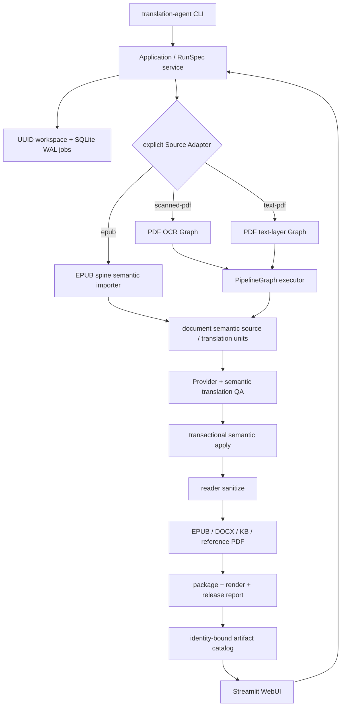

# 产品架构与迭代边界

本页描述当前可安装产品的公共边界。实现保持 local-first：单机文件、SQLite WAL
和 JSONL 足以支持长任务恢复；不依赖 Celery、Kubernetes 或远程数据库。

## 组件图



EPUB 当前能完成导入、语义翻译、事务回填和草稿发布，但尚未注册与 PDF 等价的
EPUB-native release profile。因此产品壳不会给 EPUB 草稿签发
`release_ready=true`。

## 公共契约

| 契约 | 版本 | 责任 |
| --- | --- | --- |
| `RunSpec` | v1 | 统一 CLI、服务与 UI 的输入；严格拒绝未知字段，不保存密钥 |
| `DocumentSemantic` | v1 | 文档、章节、块、来源定位、翻译单元与人工决定 |
| `ArtifactRecord` | v1 | 文件身份、SHA-256、草稿/阻断/正式状态 |
| `RunEvent` | v1 | 可序列化任务事件与错误摘要 |
| Graph state/event | v1 | 节点缓存、产物指纹和恢复记录 |

Provider、Source Adapter 和 publisher 可以迭代，但不能绕过这些契约。新的字段需
先增加 schema 迁移；不能让 UI、CLI 和 Graph 分别解释不同的配置。

## DAG 不变量

1. 节点只能读取 `NodeSpec.requires` 中声明的值；未声明访问立即失败。
2. 节点收到深度隔离的输入副本，不能修改上游嵌套对象；执行前后会复核输入指纹。
3. draft semantic audit 与 reader semantic audit 是不同产物。sanitize 只能提供新的
   reader 证据，不能改写 `chapters.semantic`。
4. 缓存身份包含节点名、版本、显式 fingerprint 和依赖产物指纹；Provider 缓存还
   包含 provider、endpoint、model、prompt profile、thinking、temperature 与术语表。
5. 发布器只消费通过的 reader semantic bundle。裸 `publication.docx` 是中间产物；
   正式 Word 目标是 `publication.word_report`。

## 语义回填不变量

`semantic_apply.py` 是 EPUB 与独立文字 PDF importer 的共享 apply 服务：

- 上游 reconstruction audit 必须明确 `passed`，且不能有 root/chapter blocker；
- unit schema、ID、章节顺序、source SHA 和 locator 必须完整一致；
- 标题层级、列表、表格、链接目标、脚注引用—定义关系不能被模型改变；
- 目标语言、普通英文残留和 glossary 在回填前复核；
- 所有章节、manifest 和 translation audit 先写 staging；提交失败回滚；
- reconstruction audit 保持不可变，新的 translation audit 记录其 SHA-256。

人工复核记录使用 append-only `review-decisions.jsonl`，决定绑定 issue/unit/source
hash；来源改变后旧决定自然失效。

## WebUI 安全模型

- 只绑定 `localhost`、`127.0.0.1` 或 `::1`；远程访问使用带认证的隧道。
- 文件路径必须位于配置的 allowlist 根目录；上传有扩展名、文件名和大小门。
- 每个任务拥有 UUID 工作区，数据库使用 SQLite WAL；支持取消、恢复和断点复用。
- 子进程环境采用 allowlist；模型凭据只在内存中传递，不进 RunSpec/SQLite/argv。
- 产物页只把 Graph state 中登记、且 release report 身份与哈希匹配的文件标为正式。

默认运行根为 `~/.translation-agent/webui/`，属于用户级本地状态，不应提交到 Git；
可通过 `TRANSLATION_AGENT_WEBUI_RUNTIME_ROOT` 覆盖。源码运行优先读取仓库内
的 Profile/Recipe，wheel 安装则从 `sys.prefix/share/translation-agent/` 读取
同一组受信资源。

## 轻量迭代流程

```text
改 schema/契约 → 写迁移或兼容读取 → 增加跨 adapter fixture
             → Graph plan / cache 回归 → package/render gate → 发布版本
```

每次合并前至少运行：

```bash
translation-agent-repo-guard
python -m unittest discover tests
python -m compileall -q .
python -m build
```

CI 在 Python 3.11 和 3.12 上执行相同快速门；需要 LibreOffice 与固定字体的真实
渲染 smoke 可放在 nightly/release job，避免拖慢日常小改动。
