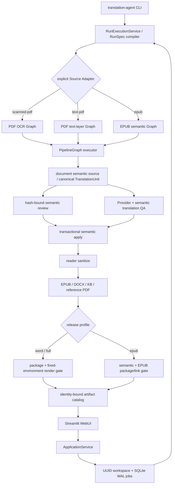

# 产品架构与迭代边界

本页描述当前可安装产品的公共边界。实现保持 local-first：单机文件、SQLite WAL
和 JSONL 足以支持长任务恢复；不依赖 Celery、Kubernetes 或远程数据库。

## 组件图


```mermaid
flowchart TB
    CLI["translation-agent CLI"] --> RUN["RunExecutionService / RunSpec compiler"]
    UI["Streamlit WebUI"] --> APP["ApplicationService"]
    APP --> JOBS["UUID workspace + SQLite WAL jobs"]
    JOBS --> RUN
    RUN --> ADAPTER{"explicit Source Adapter"}
    ADAPTER -->|"scanned-pdf"| OCR["PDF OCR Graph"]
    ADAPTER -->|"text-pdf"| TEXT["PDF text-layer Graph"]
    ADAPTER -->|"epub"| EPUB["EPUB semantic Graph"]
    OCR --> DAG["PipelineGraph executor"]
    TEXT --> DAG
    EPUB --> DAG
    DAG --> SOURCE["document semantic source / canonical TranslationUnit"]
    SOURCE --> REVIEW["hash-bound semantic review"]
    SOURCE --> TRANSLATE["Provider + semantic translation QA"]
    REVIEW --> APPLY["transactional semantic apply"]
    TRANSLATE --> APPLY
    APPLY --> SANITIZE["reader sanitize"]
    SANITIZE --> PUBLISH["EPUB / DOCX / KB / reference PDF"]
    PUBLISH --> VERIFY{"release profile"}
    VERIFY -->|"word / full"| RENDER["package + fixed-environment render gate"]
    VERIFY -->|"epub"| EPUBVERIFY["semantic + EPUB package/link gate"]
    RENDER --> CATALOG["identity-bound artifact catalog"]
    EPUBVERIFY --> CATALOG
    CATALOG --> UI
```

EPUB 已注册 first-class Graph 和独立的 `epub` release profile。正式目标
`publication.epub_report` 会闭包选择源检查、spine 语义重建、可选单元翻译、
reader 物化、EPUB 发布和 `core.publication.verify.epub`；通过后才签发
`release_ready=true`。裸 `publication.epub` 与 `publication.docx` 是直接出版
目标，必须关闭 verify，且始终按草稿处理。EPUB 来源的 Word 目前没有独立的
OOXML/render release profile，不能借 EPUB 报告转正。

`RunExecutionService` 是 RunSpec 的唯一产品级解释器：CLI 与 Web worker 均从这里
获得相同的来源能力、targets、计划和执行结果。PDF 和 EPUB 的完整 `run` 计划现在
都由真实 `NodeSpec` 组成并报告 `executor=graph`。`ingest`、`translate`、`apply`
和 `publish` 仍是兼容的细粒度工具；其中单独 `publish` 不运行 native release
profile，因此返回草稿，不得与完整 `run` 的正式目标混用。

## 公共契约

| 契约 | 版本 | 责任 |
| --- | --- | --- |
| `RunSpec` | v1 | 统一 CLI、服务与 UI 的输入；严格类型、来源/目标能力，不保存密钥 |
| `DocumentSemantic` | v1 | 文档、章节、语义块、来源定位与资产清单 |
| `TranslationUnit` | v1 | 8 个固定字段、稳定顺序、源文本 SHA-256 与一个或多个 `SourceLocator` |
| `ReviewDecision` | v1 | append-only 人工决定；绑定 reconstruction、subject、source hash 与审计理由 |
| `ArtifactRecord` | v1 | 文件身份、SHA-256、草稿/阻断/正式状态 |
| `RunEvent` | v1 | 可序列化任务事件与错误摘要 |
| Graph state/event | v1 | 节点缓存、产物指纹和恢复记录 |

Provider、Source Adapter 和 publisher 可以迭代，但不能绕过这些契约。新的字段需
先增加 schema 迁移；不能让 UI、CLI 和 Graph 分别解释不同的配置。

## DAG 不变量

1. 节点只能读取 `NodeSpec.requires` 中声明的值；未声明访问立即失败。
2. 节点收到深度隔离的输入副本，不能修改上游嵌套对象；执行前后会复核输入指纹。
3. draft semantic audit 与 reader semantic audit 是不同产物。sanitize 只能提供新的
   reader 证据，不能改写 `chapters.semantic`。
4. 缓存身份包含节点名、版本、显式 fingerprint 和依赖产物指纹；Provider 缓存还
   包含 provider、endpoint、model、prompt profile、thinking、temperature 与术语表。
5. 发布器只消费通过的 reader semantic bundle。裸 `publication.docx` 是中间产物；
   正式 Word 目标是 `publication.word_report`。
6. EPUB 的 source、semantic source、translation、reader 与 publication 各是独立
   artifact；翻译开关变化不得让译文 reader 污染源语言 reader 的缓存。
7. `publication.epub_report` 必须依赖同次 Graph 记录的 `source.epub`、
   `semantic.review`、`chapters.reader` 与 `publication.epub`；验收报告节点不缓存，
   以便每次重新绑定当前文件身份。

## EPUB Graph 与发布契约

EPUB 的正常节点链为：

```text
core.source.epub.inspect
  → core.reconstruct.epub_semantic
  → core.semantic.review
  → [core.semantic.translate → core.semantic.apply]
    或 core.semantic.materialize_reader（不翻译）
  → core.publish.epub
  → core.publication.verify.epub
```

`translation_mode=apply` 时，在线翻译节点替换为
`core.semantic.translations.inspect → core.semantic.apply`。另可从 reader 分支生成
`core.publish.docx`，但该产物仍为草稿。当前 EPUB Graph 支持显式 artifact targets，
尚不消费 Graph Recipe TOML；产品层收到 EPUB + `recipe` 会在计划阶段拒绝，不会
静默忽略。知识库、参考 PDF、`publication.report` 和
`publication.word_report` 也不属于 EPUB target 集合。

EPUB native verifier 是确定性的包/语义门，不调用模型，也不是视觉渲染门。它核对
源文件和 reconstruction/review/translation audit 的哈希绑定、canonical 章节顺序与正文、
脚注闭环、EPUB3 container/OPF/manifest/spine/nav、语言、资源清单、内部链接/fragment
和成品 SHA-256。外部 `http`/`https`/`mailto` 超链接可以保留，但外部图片/媒体不
允许；所有 `src` 必须指向包内资源。

当前 importer/publisher 仍是 text-first：普通跨-spine XHTML 链接已按两遍 manifest
映射重写，被引用 fragment 也会保留为发布锚点；但图片二进制复制、媒体类型登记和
非 spine 资源重写尚未形成完整资产管线。含内嵌图片的书可能在 native gate 被阻断；
这属于明确限制，不能通过放宽链接/资源检查
变成“正式发布”。native gate 也不替代阅读器矩阵、图片像素/替代文本质量或视觉
分页检查。

## 语义回填不变量

`semantic_apply.py` 是 EPUB 与独立文字 PDF importer 的共享 apply 服务：

- 上游 reconstruction audit 必须明确 `passed`，且不能有 root/chapter blocker；
- unit schema、ID、章节顺序、source SHA 和 locator 必须完整一致；
- 标题层级、列表、表格、链接目标、脚注引用—定义关系不能被模型改变；
- 目标语言、普通英文残留和 glossary 在回填前复核；
- 所有章节、manifest 和 translation audit 先写 staging；提交失败回滚；
- reconstruction audit 保持不可变，新的 translation audit 记录其 SHA-256。

当前 writer 输出的 canonical `TranslationUnit` 字段固定为
`schema_version`、`id`、`chapter_id`、`sequence`、`kind`、`source_markdown`、
`source_sha256`、`locators`。EPUB locator 使用 `adapter=epub`、`href` 和
零基 `block_index`；文字 PDF locator 使用 `adapter=text-pdf`、页或页范围来源和
零基 `block_index`。strict `TranslationUnit.from_dict()` 只接收 canonical 形状；
runner/apply 边界使用 normalizer，对既有 schema-v1 行兼容读取 `source_href`、
`source_pages` 以及旧 `kind=list`，但拒绝新旧 locator 混写。所有当前 writer
只写 canonical 形状，避免兼容字段继续扩散。

人工复核使用 append-only `audit/review-decisions.jsonl`。中央 policy 从不可变的
`semantic-reconstruction.json` 完整重算 blocker 集合，决定绑定 reconstruction、
subject 与 source hash；派生 `semantic-review.json` 和内容寻址快照。当前 v1 只允许
将文字 PDF 章节中的 `pdf_visible_superscript_unresolved` 明确记录为
`accepted + reason=accept_as_text`；未知、根级、结构替换及所有来源/哈希/包完整性
问题均不可豁免。apply、EPUB Graph、EPUB 与 Word/full verifier、Web artifact catalog
都复验同一 raw → review → effective bundle 哈希链；旧 PDF 审计会在报告中明确标为
`review_required=false`，且只在复核证据从未出现时维持原始阻断契约。

## WebUI 安全模型

- 只绑定 `localhost`、`127.0.0.1` 或 `::1`；远程访问使用带认证的隧道。
- 文件路径必须位于配置的 allowlist 根目录；上传有扩展名、文件名和大小门。
- 每个任务拥有 UUID 工作区，数据库使用 SQLite WAL 和顺序 schema migration；支持
  取消、恢复和断点复用。
- worker 使用一次性 identity token；取消任务前必须验证 PID 仍属于该任务，无法
  证明身份时不得发送信号。
- 取消采用两阶段状态：先进入 `cancel_requested` 并保留租约，确认旧进程退出后
  才进入 `cancelled`；取消未完成前禁止恢复，避免两个 worker 并发写同一输出。
- 子进程环境采用 allowlist；模型凭据只在内存中传递，不进 RunSpec/SQLite/argv。
- Web 计划与 worker 显式关闭仓库 `.env` 自动加载；兼容 CLI 默认行为不会穿透到
  Web 凭证沙箱。
- 产物页只把 Graph state 中登记、且 release report 身份与哈希匹配的文件标为正式。
- EPUB 新任务默认开启质量门并选择 `publication.epub_report`；用户关闭质量门后
  才能把裸 EPUB/Word 作为草稿 targets。若同时选择 Word，只有 EPUB 会被 native
  report 覆盖，Word 仍显示草稿。

默认运行根为 `~/.translation-agent/webui/`，属于用户级本地状态，不应提交到 Git；
可通过 `TRANSLATION_AGENT_WEBUI_RUNTIME_ROOT` 覆盖。源码运行优先读取仓库内
的 Profile/Recipe，wheel 安装则从 `sys.prefix/share/translation-agent/` 读取
同一组受信资源。

## 轻量迭代流程

```text
改 schema/契约 → 写迁移或兼容读取 → 增加跨 adapter fixture
             → Graph plan / cache 回归 → package/render gate → 发布版本
```

每次合并前至少运行：

```bash
translation-agent-repo-guard
python -m unittest discover tests
python -m compileall -q .
python -m build
```

CI 在 Python 3.11 和 3.12 上执行相同快速门；需要 LibreOffice 与固定字体的真实
渲染 smoke 可放在 nightly/release job，避免拖慢日常小改动。
