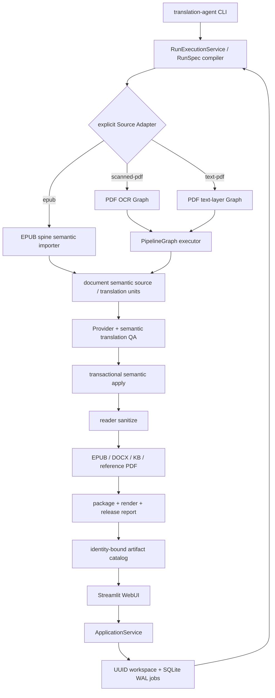

# 产品架构与迭代边界

本页描述当前可安装产品的公共边界。实现保持 local-first：单机文件、SQLite WAL
和 JSONL 足以支持长任务恢复；不依赖 Celery、Kubernetes 或远程数据库。

## 组件图


```mermaid
flowchart TB
    CLI["translation-agent CLI"] --> RUN["RunExecutionService / RunSpec compiler"]
    UI["Streamlit WebUI"] --> APP["ApplicationService"]
    APP --> JOBS["UUID workspace + SQLite WAL jobs"]
    JOBS --> RUN
    RUN --> ADAPTER{"explicit Source Adapter"}
    ADAPTER -->|"scanned-pdf"| OCR["PDF OCR Graph"]
    ADAPTER -->|"text-pdf"| TEXT["PDF text-layer Graph"]
    ADAPTER -->|"epub"| EPUB["EPUB spine semantic importer"]
    OCR --> DAG["PipelineGraph executor"]
    TEXT --> DAG
    EPUB --> SOURCE["document semantic source / translation units"]
    DAG --> SOURCE
    SOURCE --> TRANSLATE["Provider + semantic translation QA"]
    TRANSLATE --> APPLY["transactional semantic apply"]
    APPLY --> SANITIZE["reader sanitize"]
    SANITIZE --> PUBLISH["EPUB / DOCX / KB / reference PDF"]
    PUBLISH --> VERIFY["package + render + release report"]
    VERIFY --> CATALOG["identity-bound artifact catalog"]
    CATALOG --> UI
```

EPUB 当前能完成导入、语义翻译、事务回填和草稿发布，但尚未注册与 PDF 等价的
EPUB-native release profile。因此产品壳不会给 EPUB 草稿签发
`release_ready=true`。

`RunExecutionService` 是 RunSpec 的唯一产品级解释器：CLI 与 Web worker 均从这里
获得相同的来源能力、targets、计划和执行结果。计划中的 `executor=graph` 表示真实
`NodeSpec`，`executor=adapter` 表示尚在 Graph 外、但受同一能力和阻断契约约束的
有界步骤；二者不得使用相同名称伪装成同一种执行机制。

## 公共契约

| 契约 | 版本 | 责任 |
| --- | --- | --- |
| `RunSpec` | v1 | 统一 CLI、服务与 UI 的输入；严格类型、来源/目标能力，不保存密钥 |
| `DocumentSemantic` | v1 | 文档、章节、块、来源定位、翻译单元与人工决定 |
| `ArtifactRecord` | v1 | 文件身份、SHA-256、草稿/阻断/正式状态 |
| `RunEvent` | v1 | 可序列化任务事件与错误摘要 |
| Graph state/event | v1 | 节点缓存、产物指纹和恢复记录 |

Provider、Source Adapter 和 publisher 可以迭代，但不能绕过这些契约。新的字段需
先增加 schema 迁移；不能让 UI、CLI 和 Graph 分别解释不同的配置。

## DAG 不变量

1. 节点只能读取 `NodeSpec.requires` 中声明的值；未声明访问立即失败。
2. 节点收到深度隔离的输入副本，不能修改上游嵌套对象；执行前后会复核输入指纹。
3. draft semantic audit 与 reader semantic audit 是不同产物。sanitize 只能提供新的
   reader 证据，不能改写 `chapters.semantic`。
4. 缓存身份包含节点名、版本、显式 fingerprint 和依赖产物指纹；Provider 缓存还
   包含 provider、endpoint、model、prompt profile、thinking、temperature 与术语表。
5. 发布器只消费通过的 reader semantic bundle。裸 `publication.docx` 是中间产物；
   正式 Word 目标是 `publication.word_report`。

## 语义回填不变量

`semantic_apply.py` 是 EPUB 与独立文字 PDF importer 的共享 apply 服务：

- 上游 reconstruction audit 必须明确 `passed`，且不能有 root/chapter blocker；
- unit schema、ID、章节顺序、source SHA 和 locator 必须完整一致；
- 标题层级、列表、表格、链接目标、脚注引用—定义关系不能被模型改变；
- 目标语言、普通英文残留和 glossary 在回填前复核；
- 所有章节、manifest 和 translation audit 先写 staging；提交失败回滚；
- reconstruction audit 保持不可变，新的 translation audit 记录其 SHA-256。

人工复核的目标契约是 append-only `review-decisions.jsonl`，决定绑定
issue/unit/source hash；当前数据模型和安全追加写已经存在，但 resolution → apply
→ verifier 尚未接通，不能把手工改写 audit 当作正式复核。该链闭合前，原审计的
blocking 状态仍必须 fail closed。

## WebUI 安全模型

- 只绑定 `localhost`、`127.0.0.1` 或 `::1`；远程访问使用带认证的隧道。
- 文件路径必须位于配置的 allowlist 根目录；上传有扩展名、文件名和大小门。
- 每个任务拥有 UUID 工作区，数据库使用 SQLite WAL 和顺序 schema migration；支持
  取消、恢复和断点复用。
- worker 使用一次性 identity token；取消任务前必须验证 PID 仍属于该任务，无法
  证明身份时不得发送信号。
- 取消采用两阶段状态：先进入 `cancel_requested` 并保留租约，确认旧进程退出后
  才进入 `cancelled`；取消未完成前禁止恢复，避免两个 worker 并发写同一输出。
- 子进程环境采用 allowlist；模型凭据只在内存中传递，不进 RunSpec/SQLite/argv。
- Web 计划与 worker 显式关闭仓库 `.env` 自动加载；兼容 CLI 默认行为不会穿透到
  Web 凭证沙箱。
- 产物页只把 Graph state 中登记、且 release report 身份与哈希匹配的文件标为正式。

默认运行根为 `~/.translation-agent/webui/`，属于用户级本地状态，不应提交到 Git；
可通过 `TRANSLATION_AGENT_WEBUI_RUNTIME_ROOT` 覆盖。源码运行优先读取仓库内
的 Profile/Recipe，wheel 安装则从 `sys.prefix/share/translation-agent/` 读取
同一组受信资源。

## 轻量迭代流程

```text
改 schema/契约 → 写迁移或兼容读取 → 增加跨 adapter fixture
             → Graph plan / cache 回归 → package/render gate → 发布版本
```

每次合并前至少运行：

```bash
translation-agent-repo-guard
python -m unittest discover tests
python -m compileall -q .
python -m build
```

CI 在 Python 3.11 和 3.12 上执行相同快速门；需要 LibreOffice 与固定字体的真实
渲染 smoke 可放在 nightly/release job，避免拖慢日常小改动。
