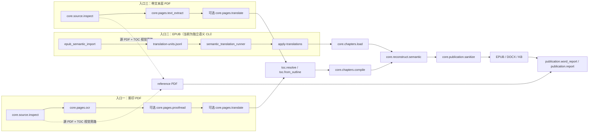

# 三入口文档语义 DAG

本文件定义影印 PDF、EPUB 和带文本层 PDF 的三入口处理契约。三个入口可以有
不同的提取实现；发布器不得直接读取 OCR 页、PDF 文本块或 EPUB XHTML。当前
可执行实现已经共享章节语义、发布清洗和验证门，但仍有两种翻译粒度；目标架构
再把三者收敛为同一种 `document.semantic.source` 后进行单元级翻译。

> 当前代码中的 `core.chapters.compile` 是**语义重建前的章节草稿组装**，不是出版编译。
> 它必须先于 `core.reconstruct.semantic`。为消除歧义，新接口和日志将这一职责
> 称为 `core.chapters.assemble_draft`；真正的 EPUB/DOCX 编译只发生在语义验收
> 和发布清洗之后。

## 当前可执行依赖图



这张图是现在可以执行的事实：影印 PDF 和带文本层 PDF 在页层可选翻译；EPUB
由语义导入器、runner 和回填命令生成章节后，再由 Graph 的
`core.chapters.load` 接入共同下游。带文本层 PDF 不含
`core.pages.ocr`；来源类型必须显式选择，不会自动猜测或静默回退。
`reference PDF` 是保留原始页面的视觉旁路，只读取源 PDF 与 TOC，并与语义
出版物一起进入最终 verifier；它不是由 reader Markdown 重新排版的文字出版物。

## 目标统一依赖图

```mermaid
flowchart LR
    subgraph S["入口一：影印 PDF"]
        S1["源文件检查"] --> S2["逐页 OCR 与版面"]
        S2 --> S3["OCR 校勘与目录映射"]
        S3 --> S4["assemble_draft\n语义重建前章节草稿"]
    end

    subgraph E["入口二：EPUB"]
        E1["ZIP/OPF 安全检查"] --> E2["spine/XHTML 提取"]
        E2 --> E3["noteref 与注释定义恢复"]
    end

    subgraph P["入口三：带文本层 PDF"]
        P1["源文件检查"] --> P2["文本层与几何提取"]
        P2 --> P3["阅读顺序、目录与注释恢复"]
    end

    S4 --> R["core.reconstruct.semantic"]
    P3 --> R
    E3 --> R
    R --> DS["document.semantic.source\n块、标题、表格、引用、定义、来源审计"]
    DS --> T1["core.semantic.translate.prepare"]
    T1 --> T2["core.semantic.translate.run"]
    T2 --> T3["core.semantic.verify"]
    T3 --> C{"结构、术语与定位符通过？"}
    C -->|"否"| Q["audit/review queue\n阻断发布"]
    C -->|"是"| DT["document.semantic.translated"]
    DT --> A["core.semantic.apply\n源 SHA 与单元集合复验"]
    A --> Z["core.publication.sanitize"]
    Z --> PUB["知识库 / EPUB / DOCX 发布器"]
    PUB --> PKG["包结构门"]
    PKG --> REN["固定环境渲染门"]
    REN --> REP["publication.report"]
```



目标顺序有三个不变量：

1. 页或 XHTML 只能作为文字出版器的来源证据，不能成为 EPUB/DOCX/KB 的隐式
   输入；明确标注的 `reference PDF` 视觉旁路除外；
2. 统一 Provider 完成后，
   `assemble_draft → reconstruct.semantic → translate → sanitize → publish` 的顺序
   不得由 Recipe 改写；当前 PDF 兼容边的页级翻译仍位于 `assemble_draft` 之前；
3. 任一不确定引用落点进入 `audit/review queue`，不得由模型静默猜测后继续发布。

## 三个入口的边界

下表描述目标契约。当前 Graph 入口已经完成显式选择、全页文字覆盖、来源绑定与
共同下游；几何栏序证明和 PDF 上标—脚注关系恢复目前仅由独立
`born_digital_pdf_import.py` 提供，尚未成为 Graph `core.pages.text_extract` 的
发布能力。

| 入口 | 适用判定 | 入口专属工作 | 收敛产物 |
| --- | --- | --- | --- |
| 影印 PDF | 无可信文本层，或抽样文本层质量未过门 | OCR、版面、页码映射、跨页拼接、语义重建前章节草稿 | `document.semantic.source` |
| EPUB | ZIP/OPF/spine 可解析且无 DRM 阻断 | XHTML 结构、内部链接、`noteref`/定义闭环 | `document.semantic.source` |
| 带文本层 PDF | 抽样覆盖率、字符质量、阅读顺序均过门 | 文本与几何提取、栏序恢复、脚注候选匹配 | `document.semantic.source` |

当前 Graph 不进行自动识别；正式运行必须选择 `scanned-pdf` 或 `text-pdf`，
并把源文件 SHA-256 和所选 adapter 写进来源身份。同一输出目录不得在没有显式
迁移的情况下切换 adapter。
当前 text-PDF Graph 会对整本逐页验收，不使用抽样：内部正文页缺少文字层即
阻断，纯空白首尾页以显式检查点保留。更高阶的字符质量、栏序和脚注语义门由
独立 importer 提供；它们接入统一 Provider 后也必须明确阻断或要求用户选择
OCR，不能静默降级并复用另一入口的缓存。

DOCX 语义迁移属于审定稿导入/回归工具，不计入这三个源书入口。它若进入同一
发布链，也必须先生成等价的 `document.semantic.source`，不能把已有 Word 当作
已通过语义验收的证据。

## CLI 命名

当前兼容入口继续有效：

```bash
# 影印 PDF
python graph_pipeline.py book.pdf -o outputs/book --phase all --plan

# 带文本层 PDF
python graph_pipeline.py book.pdf -o outputs/book --phase all \
  --source-mode text-pdf --translate-non-chinese \
  --recipe recipes/text-pdf-full-publication.toml

# 直接生成标准语义层（适用于独立翻译单元工作流）
python born_digital_pdf_import.py import book.pdf -o outputs/book-semantic

# EPUB
python epub_semantic_import.py import book.epub -o outputs/book

# EPUB 与独立 PDF 语义导入器共享的单元级准备与翻译
python semantic_translation_runner.py prepare \
  outputs/book/semantic/translation-units.jsonl \
  -o outputs/book/semantic/prepared.jsonl
python semantic_translation_runner.py run \
  outputs/book/semantic/translation-units.jsonl \
  -o outputs/book/semantic/translations.jsonl
```

`born_digital_pdf_import.py` 是语义抽取与翻译单元工具，不是完整 Graph
publication recipe：它不会伪造 `pages/page_XXXX.json`。需要正式
`publication.report` 时应使用上面的 `--source-mode text-pdf` Graph 入口；若
抽取器检测到不能闭合为定义的可见上标，则以
`pdf_visible_superscript_unresolved` 阻断，待人工恢复脚注关系后才可回填译文。

当前产品 facade 已使用“动作 + 来源类型”，不再让 WebUI 直接拼 legacy CLI；
PDF 动作委托给 Graph，EPUB 动作委托给语义 importer/runner，并明确保持草稿状态：

```text
translation-agent plan      SOURCE -o OUTPUT [--source-mode scanned-pdf|text-pdf|epub]
translation-agent ingest    SOURCE -o OUTPUT [--source-mode scanned-pdf|text-pdf|epub]
translation-agent translate        -o OUTPUT [--prepare-only]
translation-agent apply            -o OUTPUT [--translations FILE]
translation-agent review           -o OUTPUT
translation-agent publish          -o OUTPUT [--format epub|docx]
translation-agent status           -o OUTPUT
```

`translate` 的模型结果仍必须经过共享 `semantic_apply` 复验后才能写入章节；
`publish` 在没有兼容 verifier 时只返回 `publication_status=draft`。正式 Word 的
Graph 目标仍是 `publication.word_report`，不能以裸 `publication.docx` 作为成功
条件。EPUB 运行必须显式 `--no-verify` 才允许生成草稿，避免把未实现的原生门
静默当作成功。

## 发布硬阻断

以下门必须 fail closed。`--force` 可以重算缓存，不能绕过这些门。

| 门 | 最低阻断标准 |
| --- | --- |
| `SOURCE_IDENTITY` | 源路径/哈希、adapter 或输出目录绑定不一致 |
| `SOURCE_SAFETY` | EPUB 路径穿越、加密/DRM、外部资源未封存；PDF 解析失败 |
| `SEMANTIC_ORDER` | 章节、块或翻译单元集合缺失、重复、乱序，或源 SHA 不匹配 |
| `REFERENCE_CLOSURE` | 引用与定义非一一对应、ID 重复、孤儿定义/续段、低置信度落点 |
| `TRANSLATION_STRUCTURE` | 保护标记少传/多传/重排，标题或表格结构改变，模型前言/围栏混入 |
| `TRANSLATION_LANGUAGE` | 长正文无中文、异常长度比、显著未译普通英语、目标文字系统错误 |
| `TERMINOLOGY` | 书名、章名或强制术语表违反项目策略；同一标题出现多个译名 |
| `INDEX_LOCATORS` | 数字范围、`n.` 注释定位符、参见/另见目标丢失或不可识别 |
| `REVIEW_STATUS` | 任一 `needs_review` 未消解，或 audit 与当前语义摘要不一致 |
| `PUBLICATION_SANITIZE` | 来源文件坐标、原页锚点、内部 token 泄漏；清洗非幂等 |
| `PACKAGE_VERIFY` | EPUB manifest/spine/nav 断裂；DOCX OOXML 关系、脚注类型或 ID 错误 |
| `RENDER_VERIFY` | 异常空白、溢出、超密页、意外分页、缺字或字体环境漂移 |

索引中的目标页码不能用普通“译文长度”门替代。翻译前应解析为独立 locator
token，翻译后逐 token 对账；例如 `158n.5` 不得被不一致地改成 `158注5`，
`180–84` 也不能被当作普通数字短语重写。

## QA 测试设计

### 单元契约

- 三种 adapter 均产出相同 schema 版本、稳定 unit ID、源 SHA 和严格顺序；
- `assemble_draft` 必须拓扑先于 `reconstruct.semantic`，所有 publisher 必须依赖
  `semantic.reviewed` 和 `publication.sanitized`；
- 翻译响应分别注入：缺 token、重复 token、错序 token、模型前言、代码围栏、
  全英文、极短译文、英文普通词残留，逐项断言不落盘；
- 注释 fixture 覆盖真脚注、章末注、匿名续段、孤儿续段、重复 ID 和低置信度落点；
- 索引 fixture 精确覆盖 `12-14`、`86n.18`、`158n`、交叉参见和内部链接清洗；
- 术语 fixture 固定书名、章名和同形多义词，并把术语表摘要纳入缓存身份；
- sanitize 连续运行两次摘要相同，且不删除可见语义内容。

### 端到端最小样本

| fixture | 必须验证的回归 |
| --- | --- |
| `pdf_ocr_two_pages` | 跨页断句后才建语义块；无页眉页码泄漏 |
| `pdf_text_two_columns` | 文本层覆盖率合格、双栏阅读顺序稳定、脚注落点确定 |
| `epub_spine_notes` | spine 顺序、noteref/definition 闭环、匿名续段归并 |
| `translation_mixed_index` | 中文覆盖、未译英语、标题/术语一致、locator 原样闭环 |
| `docx_true_footnotes` | separator、continuationSeparator、关系文件和渲染空白回归 |

每个 fixture 都应运行三类断言：语义 JSON/JSONL 的结构断言、发布包的结构断言、
固定字体环境下的页面外观断言。任何一步失败都不得生成或更新
`publication.report`；失败报告须列出精确 chapter/unit/footnote ID 和可重跑命令。

## 迁移约束

带文本层 PDF 已通过显式 `--source-mode text-pdf` 接入现有 PDF Graph：
`core.pages.text_extract` 产出的 PageRecord 会固定声明
`ocr_model=text-layer/pymupdf-v1`，随后使用既有页级翻译、目录与章节编译节点。
该兼容路径不会调用 OCR，也不会自动猜测来源类型。独立
`born_digital_pdf_import.py` 与 EPUB importer 则生成标准语义翻译单元；未来把
`core.semantic.translate.run` 注册为三入口统一 Provider 时，可以替换这条页级
翻译兼容边而不改变下游 semantic/sanitize/publisher 契约。

这里的“统一”指三个入口共享语义、清洗、发布与验证不变量；当前可执行实现仍有
两种翻译粒度：Graph 的文本 PDF 兼容边是 page-level translation，EPUB 与独立
PDF importer 使用 `translation-units.jsonl`。文档中的
`core.semantic.translate.*` 是下一步统一 Provider 的目标命名，尚不能作为已注册
Graph 节点调用。
